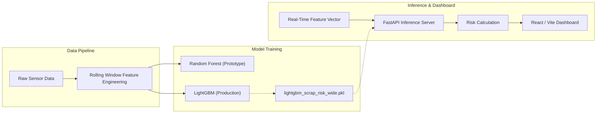

<div align="center">

<h1 align="center">TE Connectivity Predictive Monitoring</h1>

**Machine-learning predictive scrap-risk system featuring model inference, real-time feature processing, and an operational dashboard.**

[](https://github.com/Vishh70/te-connectivity-predictive-maintenance)
[](LICENSE)

| Problem | Solution | AI/ML | Backend | Frontend |
|:---|:---|:---|:---|:---|
| High-volume mechanical scrap | ML-driven risk forecasting | LightGBM, Random Forest (Experimental) | Python, FastAPI | React, Vite |

</div>

---

## Overview

TE Connectivity Predictive Monitoring is an end-to-end machine learning system designed to monitor mechanical production fleets and predict the risk of scrap outcomes before they occur. It transforms high-frequency mechanical sensor data into structured features, performs millisecond-latency risk inference, and visualizes the results on an operator-facing dashboard.

## Architecture

The system is separated into training pipelines and an isolated inference environment.



## Model Architecture & Algorithm Selection

### Algorithm Reconciliation
During development, multiple algorithms were evaluated to balance predictive accuracy against inference latency:
- **Experimental Prototype:** `RandomForestClassifier` (100-200 trees) was used for initial feature validation and baseline establishment (`scrap_probability_model.pkl`).
- **Current Inference Model:** `LightGBM` is deployed as the active inference engine (`lightgbm_scrap_risk_wide.pkl`). LightGBM was selected because its histogram-based decision tree approach provides substantially faster inference times when evaluating wide, rolling-window feature vectors in real-time.

### Feature Engineering
The model operates on a time-series rolling window approach, processing variables such as `Injection_pressure` and other machine telemetry. Counter-based non-causal features (e.g., `Scrap_counter`, `Shot_counter`) are explicitly dropped during processing to prevent data leakage.

## Repository Structure

To ensure a clean separation between data-science experimentation and software engineering, the repository is structured as follows:

- `models/` — Serialized machine learning artifacts (`.pkl` files) loaded by the backend.
- `processed/features/` — Contains inference feature maps and demo data formats.
- `backend/` — FastAPI application providing inference routes.
- `frontend/` — React/Vite operational dashboard.
- `scripts/` — Python scripts for training, data splitting, and model evaluation (Not required for inference).

*Note: Large raw training datasets are intentionally excluded via `.gitignore` to maintain repository performance.*

## Quick Start (Inference-Ready)

This repository is configured so you can run the inference backend and dashboard locally without needing to retrain the models. 

### 1. Prerequisites
- Python 3.10+
- Node.js 18+

### 2. Clone and Setup Backend
```bash
git clone https://github.com/Vishh70/te-connectivity-predictive-maintenance.git
cd te-connectivity-predictive-maintenance/backend

python -m venv .venv
# Activate venv: Windows: `.venv\Scripts\activate`, Mac/Linux: `source .venv/bin/activate`

pip install -r requirements.txt
uvicorn api:app --host 0.0.0.0 --port 8080
```
*The backend API will run at `http://127.0.0.1:8080`*

### 3. Setup Frontend
In a new terminal window:
```bash
cd te-connectivity-predictive-maintenance/frontend
npm install
npm run dev
```
*The dashboard will be available at `http://127.0.0.1:5173`*

## API Reference

The FastAPI backend exposes the following primary routes for the dashboard:

- `GET /api/status/{machine_id}`
  - **Purpose:** Returns the current operational status and aggregated scrap risk score for a specific machine (e.g., `M-231`).
- `GET /api/trend/{machine_id}/{sensor_name}`
  - **Purpose:** Fetches the historical telemetry trend for a specific sensor (e.g., `Injection_pressure`) to render UI charts.

## Limitations

- **Prototype Thresholds:** The risk threshold mapping (Low, Medium, High) is currently statically calibrated based on the validation subset. Production deployment would require dynamic calibration against real-world mechanical tolerance drifts.
- **Stateless Inference:** The current FastAPI implementation processes features in a stateless manner. A production scale-up would require a time-series database (e.g., TimescaleDB) or message broker (e.g., Kafka) to stream rolling features rather than processing static `.parquet` batches.

## License

This project is open-source and available under the MIT License.
